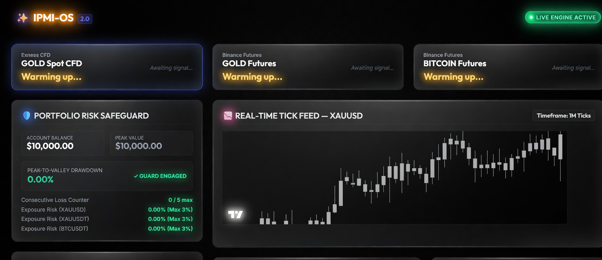
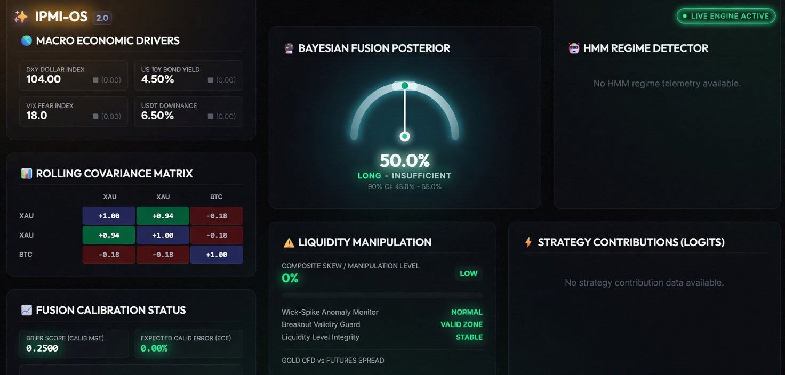

<div align="center">

<br/>

```
██╗██████╗ ███╗   ███╗██╗      ██████╗ ███████╗
██║██╔══██╗████╗ ████║██║     ██╔═══██╗██╔════╝
██║██████╔╝██╔████╔██║██║     ██║   ██║███████╗
██║██╔═══╝ ██║╚██╔╝██║██║     ██║   ██║╚════██║
██║██║     ██║ ╚═╝ ██║██║     ╚██████╔╝███████║
╚═╝╚═╝     ╚═╝     ╚═╝╚═╝      ╚═════╝ ╚══════╝
```

### Institutional Probabilistic Market Intelligence Operating System

**Real-time adaptive market intelligence. Built on uncertainty, not indicators.**

<br/>

[](https://impi-os-dashboard-cncn.vercel.app/)
[](https://impi-os-dashboard-cncn.vercel.app/)
[](#architecture)
[](LICENSE)

<br/>

</div>

---

## The Problem With Every Other Trading System

Most trading dashboards are **rear-view mirrors** — they tell you what happened, formatted to look like prediction. RSI, MACD, Bollinger Bands: these are deterministic functions of past price. They don't model the market. They describe it.

**IPMI-OS is built differently.**

The market is a **partially observable stochastic system** — non-stationary, regime-switching, and structurally adversarial. IPMI-OS treats it as one. Every signal is a probability distribution. Every output carries a confidence interval. The system adapts its inference model in real time as regimes shift — not by switching between preset strategies, but by continuously updating a Bayesian posterior over market state.

This is not a trading bot. This is a **probabilistic market intelligence layer**.

---

## Live Demo

> **[→ Open the live dashboard](https://impi-os-dashboard-cncn.vercel.app/)**

The dashboard surfaces the full IPMI-OS intelligence stack in real time — Bayesian fusion signal, HMM regime state, microstructure anomaly detection, and portfolio risk posture — across Gold (XAU) and Bitcoin markets simultaneously.

### Main Dashboard — Signal Feed & Risk Safeguard



*Three live instrument feeds (Gold CFD · Gold Futures · Bitcoin Futures) with real-time tick chart and a hard-gated Portfolio Risk Safeguard showing per-instrument exposure limits, consecutive loss counter, and peak-to-valley drawdown — all enforced before any execution.*

### Advanced Analytics Panel — Bayesian Intelligence Layer



*The full probabilistic stack: Bayesian Fusion Posterior with 90% confidence interval, HMM Regime Detector, Rolling Covariance Matrix (XAU/BTC), Liquidity Manipulation Monitor, Fusion Calibration Status (Brier Score), and Strategy Contribution Logits.*

---

## What Makes IPMI-OS Different

| Conventional System | IPMI-OS |
|---|---|
| Hard-coded indicator thresholds | Bayesian posterior updated per tick |
| Single regime assumed | Explicit HMM regime detection — live |
| Binary signal: buy / sell | Probability distribution + 90% CI surfaced in UI |
| Fixed position sizing | Volatility-adjusted Kelly criterion (fractional) |
| No uncertainty quantification | Brier Score + Expected Calibration Error tracked live |
| Static risk rules | CVaR-gated execution with per-instrument exposure caps |
| Microstructure-blind | Wick-spike anomaly monitor, breakout validity guard, liquidity integrity check |
| Single-asset | XAU/BTC rolling covariance matrix — cross-asset correlation live |

---

## Core Capabilities

### Bayesian Fusion Posterior
The central output of the system is not a buy/sell signal. It is a **probability distribution over the next directional move**, surfaced with a 90% confidence interval. The gauge you see in the dashboard (`50.0% LONG · INSUFFICIENT · 90% CI: 45.0%–55.0%`) is the live fusion posterior — when entropy is high, the system explicitly labels its own conviction as insufficient rather than forcing a signal.

### HMM Regime Detector
Identifies market regimes (trending, mean-reverting, high-volatility, liquidity-thin) using a **Bayesian Hidden Markov Model**. Regime posteriors propagate downstream — every other engine conditions on the current regime state before making a decision. Regime telemetry feeds into the dashboard panel in real time.

### Liquidity Manipulation Monitor
Three independent integrity checks run continuously:
- **Wick-Spike Anomaly Monitor** — detects abnormal wick-to-body ratios indicative of stop-hunts
- **Breakout Validity Guard** — validates whether breakouts have volume support
- **Liquidity Level Integrity** — checks spread stability and order book depth consistency

Composite skew and manipulation level are surfaced directly in the dashboard. Not buried in logs.

### Rolling Covariance Matrix
Live cross-asset correlation tracking across XAU and BTC. When correlation regimes shift (e.g., XAU/BTC decorrelation during flight-to-safety events), downstream position sizing adjusts automatically via the portfolio heat calculation.

### Portfolio Risk Safeguard
A **hard execution gate** — not a recommendation layer. Enforces:
- Per-instrument exposure limits (Max 3% per position: XAUUSD, XAUUSDT, BTCUSDT)
- Consecutive loss counter (0 / 5 max) with automatic de-risking
- Peak-to-valley drawdown tracking with guard engagement status
- Account balance vs peak value — drawdown triggers position scaling

### Fusion Calibration Status
The system tracks its own predictive accuracy in real time:
- **Brier Score (Calib MSE)** — measures probabilistic forecast accuracy
- **Expected Calibration Error (ECE)** — measures reliability of stated confidence levels

A system that monitors its own calibration is a system that knows when to trust itself.

---

## Architecture

```
┌────────────────────────────────────────────┐
│        Heterogeneous Market Feed Ingest    │
│   (WebSocket / REST, clock-drift corrected)│
│   Exness CFD · Binance Futures (Gold/BTC)  │
└───────────────────┬────────────────────────┘
                    │  Protobuf → NATS JetStream
                    ▼
┌────────────────────────────────────────────┐
│       Market Microstructure Engine         │
│  Order Flow Imbalance · Spread · Wick/LOB  │
└───────────────────┬────────────────────────┘
                    ▼
┌────────────────────────────────────────────┐
│         Regime Detection Engine            │
│     Bayesian Hidden Markov Models (HMM)    │
└───────────────────┬────────────────────────┘
                    ▼
┌────────────────────────────────────────────┐
│      Probabilistic Signal Fusion Engine    │
│  Recursive Bayesian Updates · Brier Scored │
└───────────────────┬────────────────────────┘
                    ▼
┌────────────────────────────────────────────┐
│        Risk Orchestration Engine           │
│  CVaR · Portfolio Heat · Kelly Sizing      │
│  Per-Instrument Exposure Caps · Loss Gate  │
└───────────────────┬────────────────────────┘
                    ▼
┌────────────────────────────────────────────┐
│       Low-Latency Execution Gateway        │
│       Idempotency  ·  Replay Log           │
└────────────────────────────────────────────┘
```

**Bounded Contexts (DDD):** Ingestion → Microstructure → Regime → Signal Fusion → Risk → Execution → Observability. Each context communicates through strict Protobuf message contracts over NATS JetStream. No shared state. No tight coupling.

**Latency Target:** Bayesian state posterior update upon tick receipt: **< 2.5ms**.

---

## Tech Stack

**Intelligence Layer**
- Python · PyMC · NumPy · SciPy
- Bayesian Hidden Markov Models (regime detection)
- GARCH(1,1) / FIGARCH (volatility modeling)
- Recursive Bayesian filters (signal fusion)
- Brier Score + ECE (live calibration tracking)

**Execution & Messaging**
- Go (risk + execution engine)
- NATS JetStream (ultra-low-latency pub/sub)
- Apache Kafka (cold-storage data lineage)
- Protocol Buffers v3 (event schemas)

**Infrastructure**
- Kubernetes · Docker
- Prometheus · Grafana · OpenTelemetry · Jaeger
- Redis (hot state cache)
- Terraform (NATS cluster provisioning)

**Dashboard & Frontend**
- React · TypeScript
- Vercel (edge deployment)
- WebSocket (live tick feed + 1M candlestick chart)
- TradingView Charting Library

**Market Connectivity**
- Exness CFD (Gold Spot)
- Binance Futures (Gold · Bitcoin)

---

## Quantitative Foundations

The system is built on explicit, falsifiable quantitative assumptions — not implicit heuristics.

| Assumption | Formulation | Failure Condition | Mitigation |
|---|---|---|---|
| Markovian state transitions | $P(S_t \mid S_{t-1})$ locally valid | Central bank structural break | Rolling Chow test |
| Fat-tailed returns | $r_t \sim \text{Student's } t(\nu)$, $\nu \in [2.5, 7.0]$ | Liquidity black hole ($\nu \le 1$) | Dynamic MLE on rolling window |
| Linear market impact | $\Delta P = \gamma \cdot \text{sign}(Q) \cdot \sqrt{|Q|/V}$ | Spread widening > 10× median | Real-time spread elasticity feedback |
| Volatility clustering | GARCH(1,1): $\alpha + \beta < 1$ | Integrated GARCH regime | Switch to FIGARCH |

**Kelly Sizing:** $f_i^* = f_{\text{fraction}} \cdot \frac{E[R_i] - R_f}{\sigma_i^2}$ where $f_{\text{fraction}} \in [0.1, 0.25]$

**Portfolio Heat:** $H_{\text{port}} = \sqrt{\mathbf{w}^T \mathbf{\Sigma}_{\text{corr}} \mathbf{w}}$ — hard ceiling at 0.08 daily target volatility

---

## Repository Structure

```
ipmi-os/
├── src/
│   ├── intelligence/
│   │   ├── regime_detector.py        # HMM-based regime classification
│   │   ├── fusion_engine.py          # Recursive Bayesian signal fusion
│   │   └── signal_entropy.py         # Brier score + ECE calibration
│   ├── microstructure/
│   │   ├── microstructure_analyzer.py   # OFI, spread instability, LOB
│   │   └── manipulation_detector.py     # Wick-spike, breakout validity, liquidity integrity
│   └── risk/
│       ├── risk_orchestrator.py      # CVaR, portfolio heat, loss gate
│       └── kelly_sizer.py            # Volatility-adjusted Kelly criterion
├── dashboard/                        # React/TypeScript frontend
│   ├── components/
│   │   ├── BayesianFusionGauge/      # Posterior + 90% CI display
│   │   ├── RegimePanel/              # HMM regime telemetry
│   │   ├── CovarianceMatrix/         # Live XAU/BTC correlation
│   │   ├── LiquidityMonitor/         # Manipulation detection panel
│   │   ├── RiskSafeguard/            # Portfolio risk hard gate
│   │   └── TickFeed/                 # Live candlestick chart
│   └── hooks/
│       ├── useTickFeed.ts
│       └── useRegimeState.ts
├── schemas/
│   ├── events.proto                  # Protobuf v3 message contracts
│   └── openapi.json
├── infra/
│   ├── deployment.yaml               # Kubernetes (3 replicas, readiness probe)
│   └── terraform_nats.tf
├── tests/
│   ├── test_math_models.py
│   └── test_schemas.py
└── docs/
    ├── Dashboard.jpg
    └── Advanced_Analytics_Panel.jpg
```

---

## Backtesting Methodology

Walk-Forward validation — no in-sample leakage:

```
Window 1: [─── Train 6 Months ───] [Test 1M]
Window 2:      [─── Train 6 Months ───] [Test 1M]
Window 3:           [─── Train 6 Months ───] [Test 1M]
```

Monte Carlo path simulation uses fat-tailed bootstrapping ($z_t \sim \text{Student's } t(\nu)$) across **100,000 paths** for the full VaR profile.

---

## Observability

| Metric | Type | Description |
|---|---|---|
| `ipmi_state_inference_latency_seconds` | Gauge | Per-tick Bayesian update duration |
| `ipmi_signal_entropy` | Gauge | Output uncertainty — inverse of conviction |
| `ipmi_model_drift_divergence_ratio` | Gauge | KL divergence: predictions vs empirical |
| `ipmi_risk_vetos_total` | Counter | Execution commands rejected by risk gate |

---

## Roadmap

**v2.1 — Multi-Regime Covariance Adaptation**
Cross-asset covariance matrix updates conditioned on active HMM regime. Flight-to-safety correlation collapses handled as first-class regime events.

**v2.2 — Sentiment Fusion Layer**
COT report positioning data and options skew ingested as evidence nodes in the Bayesian fusion graph. Macro driver panel extended with derivatives intelligence.

**v2.3 — Strategy Contribution Attribution**
Strategy Contributions (Logits) panel fully populated — per-strategy Shapley-value attribution to the fusion posterior. Know exactly which signal is driving conviction.

**v3.0 — Full Exchange Execution**
Idempotent order execution with replay-safe guarantees across Exness and Binance. Production audit trail. Regulatory-grade event log.

---

## Real-World Applicability

The architecture choices in IPMI-OS directly mirror patterns used in institutional quantitative infrastructure:

- **Event sourcing** is the standard for audit-compliant trading systems at tier-1 institutions
- **Bayesian regime detection** underlies systematic macro strategies at multi-billion AUM funds
- **CVaR-gated execution with consecutive-loss governors** is regulatory best practice for risk-managed systematic strategies
- **Live calibration tracking (Brier Score / ECE)** is how quantitative teams validate that their models are not just accurate — but reliably calibrated
- **Microstructure anomaly detection** is the dividing line between retail and institutional execution quality

This is not a simulation of institutional thinking. It is institutional thinking, implemented.

---

## Getting Started

```bash
git clone https://github.com/Mujahidaryan/IMPI-OS-Dashboard.git
cd IMPI-OS-Dashboard

# Intelligence layer
pip install -r requirements.txt

# Dashboard
cd dashboard && npm install && npm run dev
```

See `.env.example` for required environment variables (Exness API, Binance API, NATS URL).

---

<div align="center">

**[→ Live Dashboard](https://impi-os-dashboard-cncn.vercel.app/)** &nbsp;·&nbsp; **[Architecture](#architecture)** &nbsp;·&nbsp; **[Roadmap](#roadmap)**

<br/>

*Built with the assumption that markets are uncertain, not predictable.*

</div>
